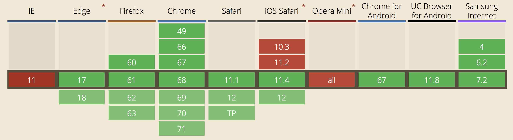

@snap[west]
@css[shout](PUSH<br>BUTTON)
@css[shout invert](RECEIVE<br>BEACON)
@snapend

---

## Beacon API

<br>

JavaScript-based Web API in modern browsers for sending small amounts of data to the web server @color[black](without waiting for a response).

<br>

We don't even get a response if we want one.

@snap[south-west linkout]
[www.w3.org/TR/beacon](https://www.w3.org/TR/beacon)
@snapend

---

# @size[0.8em](WHY WOULD WE WANT THAT?)

<br>

A number of use cases fall into the @color[black](send and forget) model.

---

### @css[usecase](Analytics)

Log page views, time on page, interaction patterns, what was shown?

### @css[usecase](Diagnostics Logging)

Trap errors in production and report back

### @css[usecase](Multivariate Tests)

Track which variants were used and how they performed

@snap[south-west continuation]
and so on...
@snapend

---

### WE CAN DO THIS ALREADY

<br>

I know what you're thinking. We can do this with the Fetch API or XHR.

<br>

But can we?

<br>

### @css[fragment](Yes. However...)

---

# @color[black](NON-BLOCKING)

<br>

Unlike everything else, Beacon is non-blocking.

<br>

It doesn't return a result, so the browser can background the request and let code execution continue.

---

## Turns out this is @color[black](super important)

<br>

Many logging behaviours are fired when the user leaves the page on the `unload` or `beforeunload` events.

Slow running code (like duh, HTTP requests) in these events kills performance.

Beacon @color[black](queues the request) and lets the browser continue, executing it in the background when it can.

---

# @color[black](BASIC USE)

<br>

```
let result = navigator.sendBeacon(url, data);
```

---

# @color[black](POSTING DATA)

The data parameter can be in one of several formats, all if which are taken directly from the Fetch API.

- Blob
- BufferSource
- FormData
- URLSearchParams

---

# @color[black](POSTING DATA)

```
let url = '/api/my-endpoint';

let data = new FormData();
data.append('hello', 'world');

let result = navigator.sendBeacon(url, data);

if (result) console.log('Successfully queued!');
```

---

# Browser Support



@snap[south-west linkout]
[https://caniuse.com/#search=beacon](https://caniuse.com/#search=beacon)
@snapend

---

# Browser Support

It's easy to test for:

```
if (navigator.sendBeacon) {
    // Beacon code
} else {
    // No Beacon. Maybe fall back to XHR?
}
```

---

### Logging page view time

```
let startTime = performance.now();

let logVisit = function() {
    if (!navigator.sendBeacon) return true;
    let url = '/api/log-visit';
    let data = new FormData();
    data.append('start', startTime);
    data.append('end', performance.now());
    data.append('url', document.URL);
    navigator.sendBeacon(url, data);
};

window.addEventListener('beforeunload', logVisit);
```

@[3, 11, 13](Register our custom handler to fire on the window's *beforeunload* event.)
@[4](Test and verify the browser has Beacon support, otherwise return.)
@[5-10](Capture the data we want to log as FormData  and send as Beacon.)

---

## Considerations when logging

@css[usecase](GDPR)

Maybe don't log stuff you don't need to log. Don't identify any sessions without considering privacy and your permitted use.

@css[usecase](Do Not Track)

If you can, honour the user's DNT header.

@size[0.7em](DNT: 0)<br>
@size[0.7em](DNT: 1)

---

@snap[north]
@size[5em](Thanks!)
@snapend

@snap[midpoint invert]
<br><br>
I'm [found here](https://twitter.com/gitpitch) on @fa[twitter]
<br><br>
Slides [found here](https://github.com/gitpitch/js-beacon-api) on @fa[github]
@snapend

